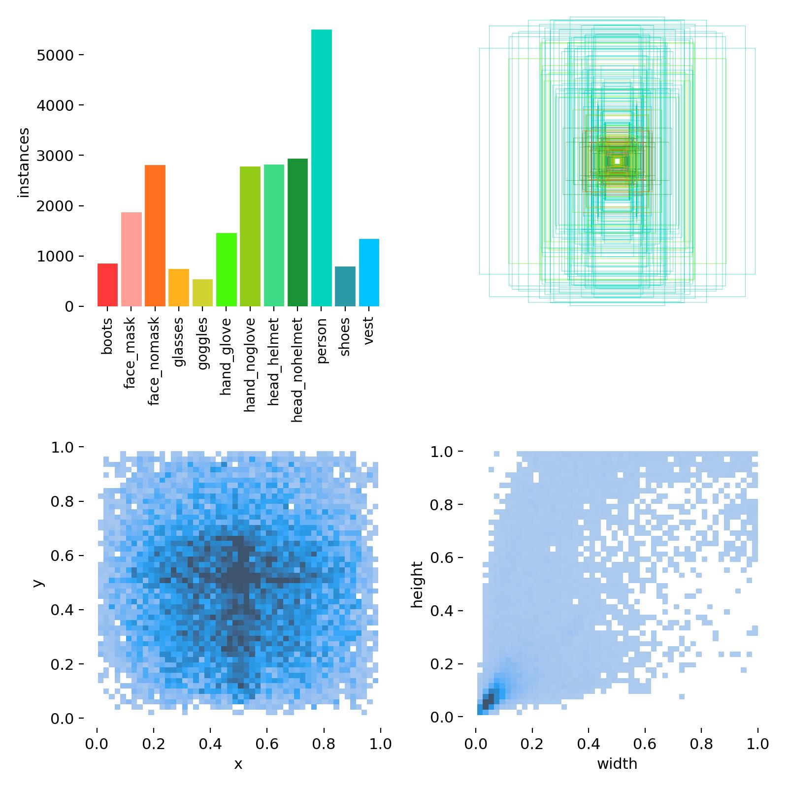
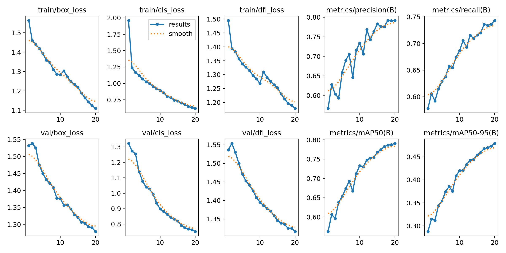
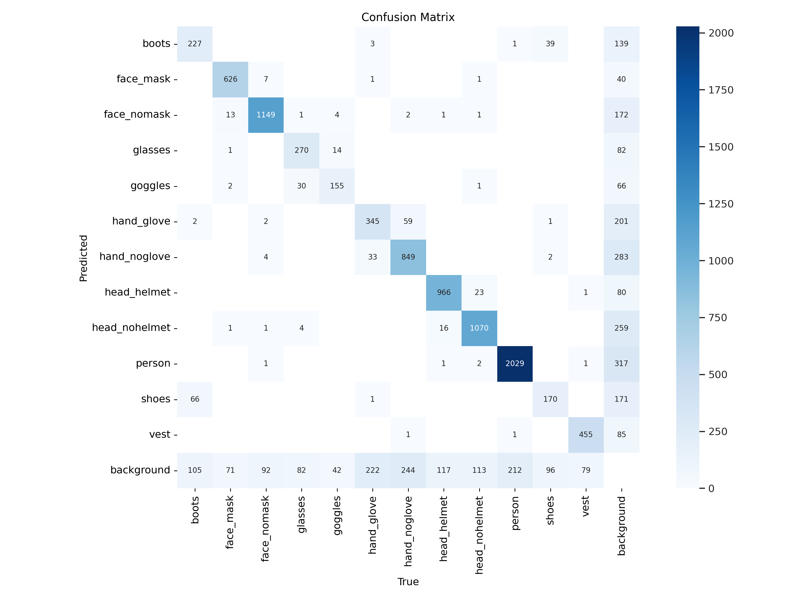

# Synapsis Challenge - Deteksi APD

## Deskripsi Proyek

Project ini merupakan challenge dari [Synapsis.id](https://synapsis.id/about) untuk mengembangkan sistem yang mampu mendeteksi Alat Pelindung Diri (APD), dengan fokus pada penggunaan APD di lingkungan pekerjaan konstruksi.

## Dataset 

Dataset yang dipakai dalam proyek ini berasal dari [ppe10-exc-cctv](https://universe.roboflow.com/ppe10/ppe10-exc-cctv) berjumlah sekitar 3000 data gambar, yang dapat diakses melalui platform data _open-source_ [Roboflow](https://universe.roboflow.com/). Dataset ini mencakup berbagai kategori, diantaranya:
- `boots`
- `face_mask`
- `face_nomask`
- `glasses`
- `goggles`
- `hand_glove`
- `hand_noglove`
- `head_helmet`
- `head_nohelmet`
- `person`
- `shoes`
- `vest`

Jumlah data untuk setiap kategori adalah sebagai berikut:



Dataset ini dipilih karena ketersediaan kategori yang cukup lengkap, mengurangi kebutuhan untuk melakukan pelabelan manual, mengingat waktu yang diberikan terbatas. Selain itu, dataset ini sudah melalui proses augmentasi gambar, meskipun masih memiliki ketidakseimbangan dalam jumlah kategori data.

## Modeling

Proyek ini menggunakan Algoritma atau pre-trained model [YOLOv8](https://docs.ultralytics.com/models/yolov8/) dari [Ultralytics](https://docs.ultralytics.com/). Alasan pemilihin Algoritma menggunakan YOLOv8 karena memiliki keunggulan untuk mendeteksi objek dalam waktu nyata dengan kecepatan tinggi, membuatnya cocok untuk berbagai aplikasi seperti pemantauan video, kendaraan otonom, dan lainnya. YOLOv8 menggunakan pendekatan _single-stage object detection_, di mana deteksi dan klasifikasi objek dilakukan dalam satu langkah.

Selain itu, YOLOv8 juga telah mengintegrasikan berbagai teknik dan inovasi terbaru dalam deteksi objek, termasuk penggunaan _backbone neural network_ yang kuat, seperti `Darknet` atau `ResNet`, dan teknik seperti _feature pyramid networks (FPN)_ untuk meningkatkan akurasi deteksi objek pada objek dengan berbagai skala dan ukuran. Berikut adalah struktur dari Algoritma YOLOv8:

```
                   from  n    params  module                                       arguments                     
  0                  -1  1       928  ultralytics.nn.modules.conv.Conv             [3, 32, 3, 2]                 
  1                  -1  1     18560  ultralytics.nn.modules.conv.Conv             [32, 64, 3, 2]                
  2                  -1  1     29056  ultralytics.nn.modules.block.C2f             [64, 64, 1, True]             
  3                  -1  1     73984  ultralytics.nn.modules.conv.Conv             [64, 128, 3, 2]               
  4                  -1  2    197632  ultralytics.nn.modules.block.C2f             [128, 128, 2, True]           
  5                  -1  1    295424  ultralytics.nn.modules.conv.Conv             [128, 256, 3, 2]              
  6                  -1  2    788480  ultralytics.nn.modules.block.C2f             [256, 256, 2, True]           
  7                  -1  1   1180672  ultralytics.nn.modules.conv.Conv             [256, 512, 3, 2]              
  8                  -1  1   1838080  ultralytics.nn.modules.block.C2f             [512, 512, 1, True]           
  9                  -1  1    656896  ultralytics.nn.modules.block.SPPF            [512, 512, 5]                 
 10                  -1  1         0  torch.nn.modules.upsampling.Upsample         [None, 2, 'nearest']          
 11             [-1, 6]  1         0  ultralytics.nn.modules.conv.Concat           [1]                           
 12                  -1  1    591360  ultralytics.nn.modules.block.C2f             [768, 256, 1]                 
 13                  -1  1         0  torch.nn.modules.upsampling.Upsample         [None, 2, 'nearest']          
 14             [-1, 4]  1         0  ultralytics.nn.modules.conv.Concat           [1]                           
 15                  -1  1    148224  ultralytics.nn.modules.block.C2f             [384, 128, 1]                 
 16                  -1  1    147712  ultralytics.nn.modules.conv.Conv             [128, 128, 3, 2]              
 17            [-1, 12]  1         0  ultralytics.nn.modules.conv.Concat           [1]                           
 18                  -1  1    493056  ultralytics.nn.modules.block.C2f             [384, 256, 1]                 
 19                  -1  1    590336  ultralytics.nn.modules.conv.Conv             [256, 256, 3, 2]              
 20             [-1, 9]  1         0  ultralytics.nn.modules.conv.Concat           [1]                           
 21                  -1  1   1969152  ultralytics.nn.modules.block.C2f             [768, 512, 1]                 
 22        [15, 18, 21]  1   2120692  ultralytics.nn.modules.head.Detect           [12, [128, 256, 512]]         
Model summary: 225 layers, 11140244 parameters, 11140228 gradients, 28.7 GFLOPs
```

Proses pelatihan model pada proyek ini menggunakan `20` _epoch_ dengan ukuran data gambar `640` dengan perangkat dan _tools_ berupa `Python-3.10.12` `torch-2.1.0+cu121 CUDA:0 (Tesla T4, 15102MiB)`. Pelatihan model selesai dengan waktu `0.651` jam atau setara dengan sekitar `39.06` menit.

## Evaluasi

Setelah proses modeling selesai didapatkan nilai dari berbagai metrik dan _confusion matrix_ sebagai berikut:





Bedasarkan kedua grafik tersebut terlihat bahwa nilai _loss_ antara `0.7 - 1.1` dan nilai _Average Precision (AP)_ antara `0.5-0.8`. Nilai tersebut sudah cukup bagus mengingat jumlah data yang digunakan tidak terlalu banyak dan juga data setiap kateogri tidak seimbang.

## Instalasi & Cara Menggunakan

Agar model yang sudah dibuat dapat digunakan, proyek ini menggunakan library [Streamlit](https://streamlit.io/) dari `Python` sebagai alat untuk melakukan _deployment_. Untuk melakukan proses deployment, berikut adalah langkah-langkahnya.

1. Clone Repository ini dengan memasukkan syntax berikut ke `command prompt`:
```
git clone https://github.com/Dapperson/synapsis-challange-apd.git
```
2. Seletah selesai melakukan `git clone` kemudian masuklah ke lokasi folder git
```
cd synapsis-challange-apd
```
3. Kemudian buatlah `virtual environment` didalam lakasi tadi
```
python -m venv venv
```
4. Aktifkan `virtual environment` dengan syntax berikut
```
venv\scripts\activate
```
5. Jika `virtual environment` sudah aktif, install library yang diperlukan
```
pip install ultralytics==8.0.196 streamlit
```
6. Tunggu sampai proses instalasi selesai, kemudian jalankan aplikasi Streamlit
```
streamlit run app.py
```

Jika semua langkah-langkah sudah dilakukan dengan benar, maka seharusnya akan muncul aplikasi dalam bentuk website yang dapat digunakan seperti video demo pada link berikut
[Demo Video](https://drive.google.com/file/d/1C1mCVDmCBTfZ_HnFLBYvkFwTg02Vv2I2/view?usp=sharing)

## Referensi
https://github.com/CodingMantras/yolov8-streamlit-detection-tracking/tree/master
